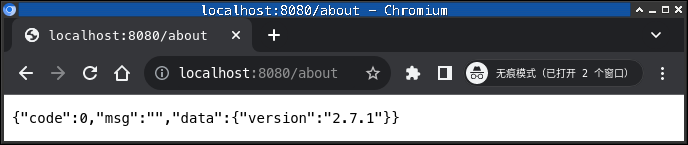
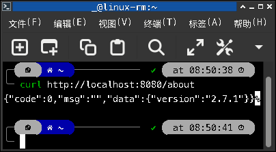
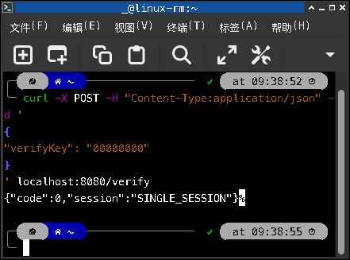
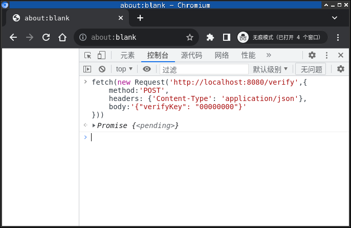
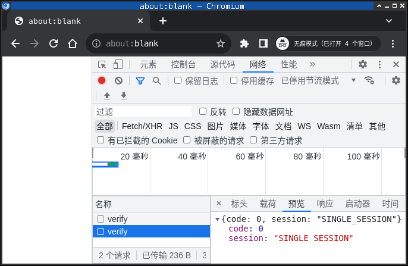

# 一个易用的开源mirai-api-http交互工具

# mirai-api-http 使用方法(新手必看)

## 安装mirai-api-http
```bash
./mcl --update-package net.mamoe:mirai-api-http --channel stable-v2 --type plugin
./mcl -u
```
## 配置

1. 编辑`config/net.mamoe.mirai-api-http/setting.yml`配置文件 (没有则自行创建)
2. 启动MCL `./mcl`
3. 记录日志中出现的`authKey`(如果有)
[查看官方setting.yml模板](https://github.com/project-mirai/mirai-api-http#settingyml%E6%A8%A1%E6%9D%BF)
或使用我的setting.yml模板
```yml
## 启用的 adapter, 内置有 http, ws, reverse-ws, webhook
adapters:
		- http

## 是否开启认证流程, 若为 true 则建立连接时需要验证 verifyKey
## 建议公网连接时开启
enableVerify: false
verifyKey: 00000000

## 是否开启单 session 模式, 若为 true，则自动创建 session 绑定 console 中登录的 bot
## 开启后，接口中任何 sessionKey 不需要传递参数
## 若 console 中有多个 bot 登录，则行为未定义
## 确保 console 中只有一个 bot 登录时启用
singleMode: true

## adapter 的单独配置，键名与 adapters 项配置相同
adapterSettings:
		## 详情看 http adapter 使用说明 配置
		http:
				host: 0.0.0.0
				port: 8080
				cors: ["*"]
				unreadQueueMaxSize: 100

```

## 验证
打开浏览器或网络工具(如 curl),直接访问[localhost:8080/about](localhost:8080/about)

正常情况下会显示





```json
{"code": 0,"msg": "","data": {"version":"xxx"}}
```

证明安装并启动成功

## 使用

---
---

### GET请求

想一想刚刚验证插件时,我们在浏览器访问了[localhost:8080`/about`](localhost:8080/about)

查阅[官方文档](https://github.com/project-mirai/mirai-api-http/blob/master/docs/adapter/HttpAdapter.md#%E5%85%B3%E4%BA%8E),发现`/about` Get 请求可以获取插件信息

---

### 关于

使用此方法获取插件的信息，如版本号

```
[GET] /about
```

通用接口定义: [关于](https://github.com/project-mirai/mirai-api-http/blob/master/docs/api/API.md#%E5%85%B3%E4%BA%8E)

---

仔细看,是不是我们在主机地址后面加入了和文档一样的`/about`

如果成功,那么你学会了

可能你会觉得难,但跟着我的步伐走绝对没错

#### 举一反三

---

### 获取登录账号

使用此方法获取所有当前登录账号

```
[GET] /botList
```

通用接口定义: [获取登录账号](https://github.com/project-mirai/mirai-api-http/blob/master/docs/api/API.md#%E8%8E%B7%E5%8F%96%E7%99%BB%E5%BD%95%E8%B4%A6%E5%8F%B7)

---

### 获取好友资料

此接口获取好友的详细资料

```
[GET] /friendProfile
```

**本接口为\[GET\]请求, 参数格式为url参数**

通用接口定义: [获取好友资料](https://github.com/project-mirai/mirai-api-http/blob/master/docs/api/API.md#%E8%8E%B7%E5%8F%96%E5%A5%BD%E5%8F%8B%E5%88%97%E8%A1%A8)

---

提示:

1. 参数: 在原有的链接后面加上`问号`, 再接上`名称1=参数1&名称2=参数2...`

   例如:`localhost:8080/friendProfile?target=114514`

2. 你可以在`setting.yml`里设置以下内容来禁用验证,或者不设置稍后学习POST得到sessionKey

```yml
enableVerify: false
verifyKey: 00000000
singleMode: true
```

---
---

### POST 请求

POST请求稍微复杂一些

你需要其中一种方式配合网络工具 `curl` 使用:

* 安卓手机 Termux
* linux系统
* windows10+
* Mac OS

或者电脑 `Chrome / Chromium`

__先别着急执行命令,因为命令中全部大写的单词 `URL`,`TYPE`,`BODY`参数还没给!!!__

### curl

终端命令用法:

```bash
curl -X POST -H "Content-Type:TYPE" -d 'BODY' URL
```

__先别着急执行命令,因为命令中全部大写的单词 `URL`,`TYPE`,`BODY`参数还没给!!!__

### 电脑 Chrome/Chromium

js命令用法:

```js
fetch(new Request('URL',{
	method:'POST',
	headers: {'Content-Type': 'TYPE'},
	body:'BODY'
}))
```

__先别着急执行命令,因为命令中全部大写的单词 `URL`,`TYPE`,`BODY`参数还没给!!!__

### 参数(仅JSON)

#### URL

其实,URL和Get请求相似,都是在主机地址后加上请求,这个我不再详细阐述

localhost:8080`/verify`

但参数要放在`BODY`里, 而且是json

#### TYPE

几乎都是`application/json`

~~备注:只有多媒体内容上传才都是`multipart/form-data`,这个先忽略,作者还不会~~

#### BDDY

这是请求,你需要参阅文档并按实际情况修改

查阅[官方文档](https://github.com/project-mirai/mirai-api-http/blob/master/docs/adapter/HttpAdapter.md),发现`/verify` Post 请求可以认证

---

### 认证

#### 接口名称
```
[POST] /verify
```
使用此方法验证你的身份，并返回一个会话

#### 请求:

```json5
{
	"verifyKey": "U9HSaDXl39ksd918273hU"
}
```

| 名字      | 类型   | 可选  | 举例                    | 说明                                                       |
| --------- | ------ | ----- | ----------------------- | ---------------------------------------------------------- |
| verifyKey | String | false | "U9HSaDXl39ksd918273hU" | 创建Mirai-Http-Server时生成的key，可在启动时指定或随机生成 |

#### 响应:

```json5
{
	"code": 0,
	"session": "UnVerifiedSession"
}
```

| 名字    | 类型   | 举例                | 说明                               |
| ------- | ------ | ------------------- | ---------------------------------- |
| code    | Int    | 0                   | 返回[状态码](../api/API.md#状态码) |
| session | String | "UnVerifiedSession" | 你的session key                    |


 session key 是使用以下方法必须携带的
 session key 使用前必须进行校验和绑定指定的Bot，**每个Session只能绑定一个Bot，但一个Bot可有多个Session**
 session Key 在未进行校验的情况下，一定时间后将会被自动释放

---

示例:

实际情况:

```yml
## 是否开启认证流程, 若为 true 则建立连接时需要验证 verifyKey
## 建议公网连接时开启
enableVerify: false
verifyKey: 00000000
```

```json
{
	"verifyKey": "00000000"
}
```

参数准备完毕,你可以尝试了

curl:

提示: curl的 BODY 参数可以换行

```bash
curl -X POST -H "Content-Type:application/json" -d '
{
	"verifyKey": "00000000"
}
' localhost:8080/verify
```

js:

js需要格外注意:

1. URL 参数前一定要有 `http://`, 否则会提示不安全或403拒绝

2. BODY 参数不能换行

```js
fetch(new Request('http://localhost:8080/verify',{
	method:'POST',
	headers: {'Content-Type': 'application/json'},
	body:'{"verifyKey": "00000000"}'
}))
```

注:由于我关闭了verifyKey验证,所以提示"SINGLE_SESSION"







**注意**

---

### 传递(重要)

`sessionKey` 作为会话的唯一标识, 它对应着服务器缓存及其上下文. 在 `adapter` 允许的情况下, 复用 `sessionKey` 创建多个连接会共享上下文

> `HttpAdapter` 允许复用 `sessionKey` 创建多个连接
在 `singleMode` 模式下: 所有需要 `sessionKey` 参数的接口可忽略 `sessionKey`

在非 `singleMode` 模式下 `sessionKey` 可通过以下方式传递:
1. 设置请求头 `sessionKey: YourSessionKey`, 大小写敏感
2. 设置请求头 `Authorization: session YourSessionKey`, `Authorization` 大小写敏感, `session` 大小写不敏感
3. 设置请求头 `Authorization: sessionKey YourSessionKey`, `Authorization` 大小写敏感, `sessionKey` 大小写不敏感
4. 通过 url参数(对于GET请求)或 json 参数(对于POST请求)填入 `sessionKey` 字段, 大小写敏感

---

#### 举一反三

---


### 绑定

```
[POST] /bind
```

使用此方法校验并激活你的Session，同时将Session与一个**已登录**的Bot绑定

#### 请求:

```json5
{
    "sessionKey": "UnVerifiedSession",
    "qq": 123456789
}
```

| 名字       | 类型   | 可选  | 举例                | 说明                       |
| ---------- | ------ | ----- | ------------------- | -------------------------- |
| sessionKey | String | false | "UnVerifiedSession" | 你的session key            |
| qq         | Long   | false | 123456789           | Session将要绑定的Bot的qq号 |

#### 响应:

```json5
{
    "code": 0,
    "msg": "success"
}
```

---


### 释放

```
[POST] /release
```

使用此方式释放session及其相关资源（Bot不会被释放）
**不使用的Session应当被释放，长时间（30分钟）未使用的Session将自动释放，否则Session持续保存Bot收到的消息，将会导致内存泄露(开启websocket后将不会自动释放)**

#### 请求:

```json5
{
    "sessionKey": "YourSessionKey",
    "qq": 123456789
}
```

| 名字       | 类型   | 可选  | 举例             | 说明                       |
| ---------- | ------ | ----- | ---------------- | -------------------------- |
| sessionKey | String | false | "YourSessionKey" | 你的session key            |
| qq         | Long   | false | 123456789        | 与该Session绑定Bot的QQ号码 |

---

### 发送好友消息

使用此方法向指定好友发送消息

```
[POST] /sendFriendMessage
```

**本接口为[POST]请求, 参数格式为`application/json`**

通用接口定义: [发送好友消息](https://github.com/project-mirai/mirai-api-http/blob/master/docs/api/API.md#%E5%8F%91%E9%80%81%E5%A5%BD%E5%8F%8B%E6%B6%88%E6%81%AF)

---

### 更多:[参阅官方文档](https://github.com/project-mirai/mirai-api-http/blob/master/docs/adapter/HttpAdapter.md)